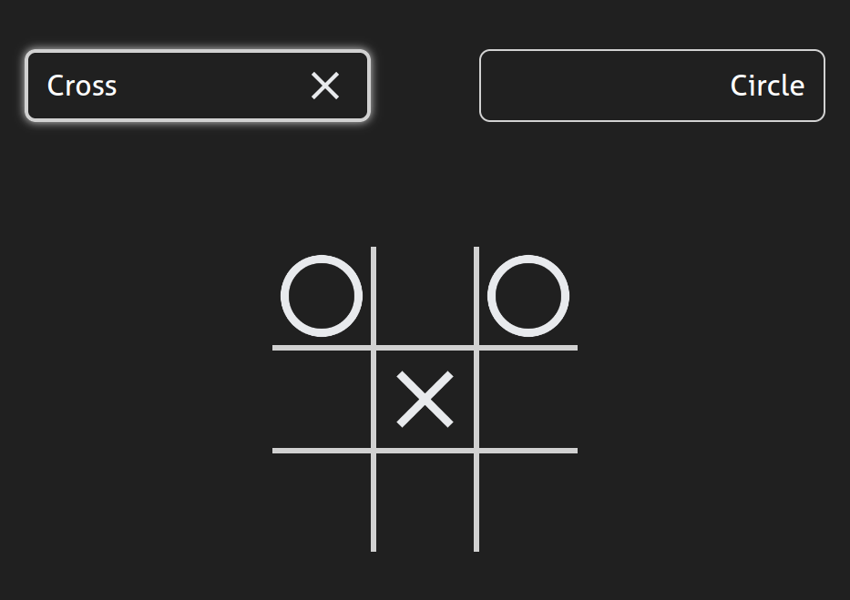

# Tic Tac Toe

A classic two-player Tic Tac Toe game built with vanilla JavaScript, focusing on modular design patterns. This project was created as part of The Odin Project curriculum to practice organizing code using the module pattern and factory functions.

## Features

- Clean, dark UI
- Visual score indicators
- Turn highlighting
- Random first player
- 3-in-a-row to win

## Outcomes

Solidified understanding of:
- JavaScript module pattern (IIFEs)
- Factory functions and closures
- DOM manipulation
- State management without frameworks
- Event handling

## Live Demo

[View Live Demo](https://miryarik.github.io/top-tic-tac-toe/)

## Acknowledgments

- Project inspiration and requirements from [The Odin Project](https://www.theodinproject.com)
- Font: Aller